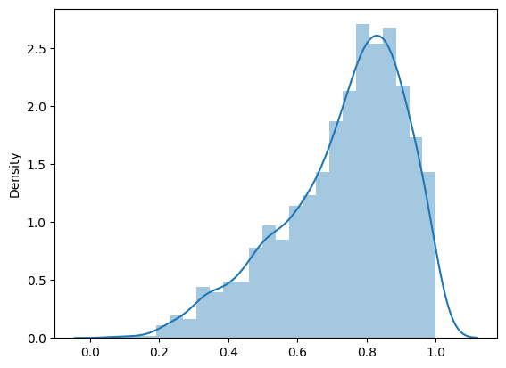

# Data Science Q&A Application

This project is designed to provide precise answers to a broad range of Data Science and Machine Learning Lifecycle questions. Whether you're looking for explanations of concepts or advice on improving your ML models, this app is here to help! 🚀

### 🔍📝👉 To learn more about RAGs, check out this [article](https://medium.com/@aishwaryahastak/understanding-the-roots-of-rags-7b77d26c3dca).

## 📈Project Overview

This application utilizes a dataset of over 600 question-answer pairs covering various Data Science topics. It offers concise and relevant responses to your queries, including use-case-specific questions such as "My regression model is overfitting on data, how can I improve its performance?" 

## RAG Flow

The Retrieval-Augmented Generation (RAG) flow combines a knowledge base with a language model to deliver accurate responses:

- **Knowledge Base:** Contains a Data Science Q&A dataset stored in `data.csv`.
- **Language Model:** Uses **Flan-T5**, an open-source model from Google available on Hugging Face, for augmented response generation.

## 📊 Retrieval Evaluation

The performance of retrieval methods was assessed using `ground-truth.csv`. The following methods were evaluated:

- **ElasticSearch:** 
  - **Hit Rate:** 0.87 
  - **Mean Reciprocal Rank (MRR):** 0.85
  - Best performing retrieval method with combined Question-Answer vector embedding.
  
- **Minisearch:** 
  - Competitive results but not as optimal as ElasticSearch.

- **Hybrid Search:** 
  - Did not achieve the best accuracy or performance compared to ElasticSearch.

Detailed results can be found in `evaluation.ipynb`. 

## 🔍 RAG Evaluation

The RAG pipeline was evaluated against the ground truth dataset using the cosine similarity metric. The system achieved a cosine similarity score of **0.8**, reflecting strong alignment with the expected results. 



## 🖥️ User Interface

The application features a simple and intuitive UI built with **Streamlit**. Users can easily input queries and view responses through a straightforward interface. 

## Ingestion Pipeline

The Python script `vectorpipeline.py`'s function read_data handles the data ingestion process:

1. Reads from `data.csv`.
2. Creates vector embeddings.
3. Indexes the data using **ElasticSearch**.

## 🌐 Deployment

The system is deployed as a **Streamlit** application, providing an interactive user interface. The deployment is managed using **Docker**, ensuring consistency and scalability of the application.

## Monitoring Feedback and Containerization

User feedback is collected via thumbs-up👍 and thumbs-down👎 buttons in the UI. This feedback is stored in a **SQLite database** and helps in improving the application based on user experiences. The application is containerized using **Docker** to simplify deployment.

## How to run this code

1. clone the repository to your local machine:
```bash
git clone https://github.com/AishwaryaHastak/RAG-using-T5.git
```

2. Navigate to the Project Directory
```
cd RAG-using-T5
```

3. Build and start the application using Docker Compose
```bash
docker-compose build
docker-compose up
```

4. Once the application is up and running, open your web browser and navigate to:
```
http://localhost:8501
```


## Acknowledgements

Detailed steps on how to use ElasticSearch in Python:

https://dylancastillo.co/posts/elasticseach-python.html#create-a-local-elasticsearch-cluster
